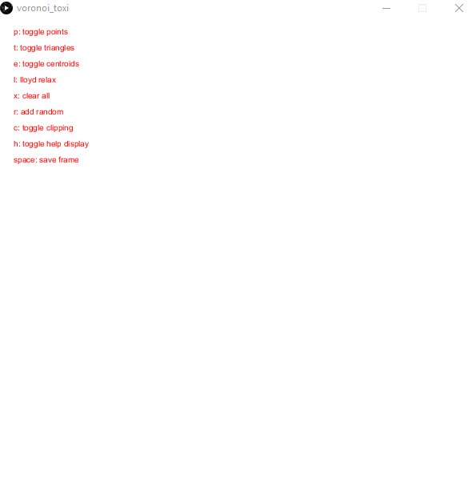

# Processing: Voronoi / Lloyd Relaxation



Requires [toxiclibs](http://toxiclibs.org) processing library.

Download the library and unzip it to ~/Documents/Processing/Libraries

Program might crash if constrained lloyd iteration takes place on a random set. Pressing the 'r' key generates a random, unconstrained voronoi diagram, which upon attempting to lloyd relax, crashes on the following method: 
```java
voronoi.addPoint(new Vec2D(centroids.get(i).x, centroids.get(i).y));
```

Apparently, there might be no triangles for a determined Delaunay vertex for such voronoi diagrams. Some sort of boundaries check or exception is still necessary.

Program works for voronoi diagrams generated with the mouse (like on the .gif)
